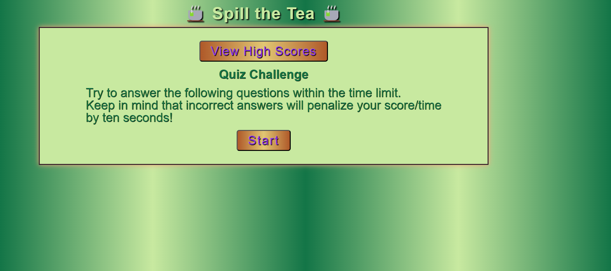
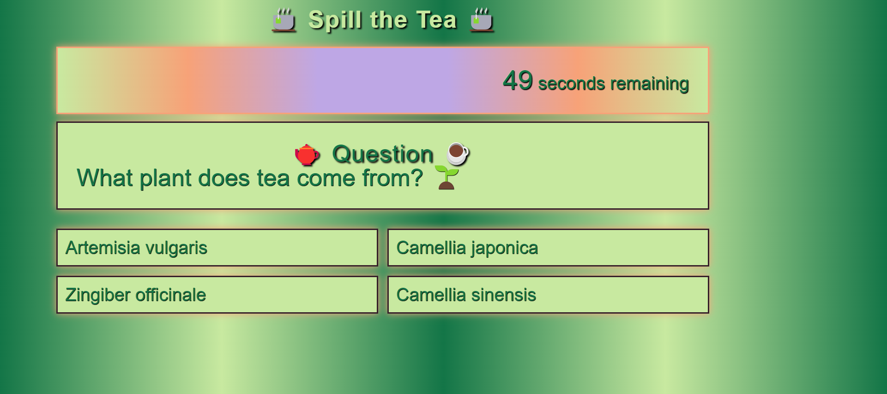
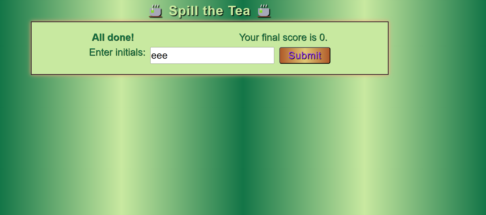
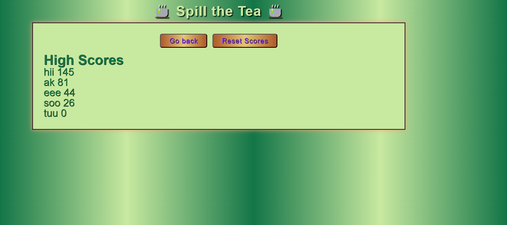

# Spill the Tea

## Description

Create a timed multiple choice quiz. To create this quiz I learned how to use event listeners to respond to events such as buttons clicks dynamically. I learned how to move to different screen views. I learned how to store and retrieve date from local storage. I learned how to have have my quiz answers shuffled so that they change during each run through. I learned how to sort my high scores in descending order. I learned how to create a timer.

### User Story

```
AS A coding boot camp student
I WANT to take a timed quiz on JavaScript fundamentals that stores high scores
SO THAT I can gauge my progress compared to my peers
```

### Acceptance Criteria

```
GIVEN I am taking a code quiz
WHEN I click the start button
THEN a timer starts and I am presented with a question
WHEN I answer a question
THEN I am presented with another question
WHEN I answer a question incorrectly
THEN time is subtracted from the clock
WHEN all questions are answered or the timer reaches 0
THEN the game is over
WHEN the game is over
THEN I can save my initials and score

```


## Installation

N/A

## Usage

Answer a multiple choice quiz.

### Deployed Site
https://fevercatdream.github.io/spill-the-tea-quiz/

<br />

### Tea Quiz Start Screen


<br />

### Tea Quiz Question Screen


<br />

### Tea Quiz End Screen


<br />

### Tea Quiz Scores Screen


<br />


## Credits

Tutor: Doug Kumagai:
<br />
https://www.linkedin.com/in/doug-kumagai/
<br />
https://github.com/ndesmic


mdn web docs: https://developer.mozilla.org/en-US/

JavaScript implementation of the Durstenfeld shuffle, an optimized version of Fisher-Yates: https://stackoverflow.com/questions/2450954/how-to-randomize-shuffle-a-javascript-array


## License

Please refer to the LICENSE in the repo.